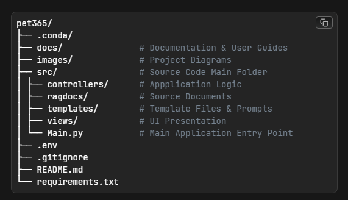

# pet365 RAG CTF

## Introduction

Building this Retrieval-Augmented Generation (RAG) application served as a hands-on learning exercise, allowing me to explore not only the architecture of RAG systems but also the emerging security vulnerabilities specific to AI. This Capture The Flag (CTF) exercise is a direct result of that exploration, designed to share those learnings in an interactive format. The best way to understand technology and its risks is often to build and experiment with it directly.


## Flow


## Capture the Flag Exercise

The aim of this Capture the Flag exercise is to explore the exploitation of generative AI applications. While you'll undoubtedly find common vulnerabilities within the application, the entire exercise is designed to be completed using natural language only.

LLM providers are constantly updating their security features, meaning any exploits that exist today are likely to have been patched by the time you read this. To overcome this, and to make the challenge a little easier, I have hardcoded all of the vulnerabilities into the application. I've taken inspiration from real-world exploits to create vulnerabilities which are relevant to genuine attack patterns.

Email me for a Pinecone API key to get started.

Rules:
- All flags must be found through the chat interface.
- Flags are in the format: `FLAG{...}`
- The Pinecone API has write access. Please don't abuse the Pinecone database.
- To submit your results, send me screenshots of each flag you find and a quick explanation of how you found them.
- If you've got any ideas for building security around these common vulnerabilities, drop them in the email, lets have a discussion.

Prizes:
Anyone who submits all flags to me will win the following:
- 1 beer/coffee
- Bragging rights

Tips:
- Read the code. I've left detailed descriptions throughout the codebase to guide you. Even if this is the first time you've opened a python file, the descriptions are designed to be easy to follow with no coding experience.
- Start with src/controllers/vector_utils.py file.
- LLM outputs are non-deterministic. If you don't see the flag on your first attempt, try again.
- If you get stuck, shoot me a message and I'll send you a hint.

Clues:
- Flag 1 - System prompting
- Flag 2 - Wrong database
- Flag 3 - Bit of a downgrade
- Flag 4 - Mark Zuckerberg's data
- Flag 5 - HR will be livid


## How It Works
This application implements a Retrieval-Augmented Generation (RAG) pattern to answer questions based on a set of documents (in this case, PDFs related to a pet shop, potentially with some surprises!).

1.  **Indexing:**
    * Documents (PDFs in the `ragdocs` directory) are loaded, cleaned, and split into smaller text chunks (`vector_utils.py`).
    * Each text chunk is converted into a numerical vector (embedding) using an AI model (OpenAI's embedding model`).
    * These embeddings, along with the original text chunks and metadata, are stored in a vector database (Pinecone).

2.  **Querying (Runtime Process):**
    * The user interacts via a web interface (Gradio - `frontpage.py`).
    * API keys for the selected LLM are managed via environment variables and the `.env` file (`api_utils.py`).
    * When a user sends a query (`ai_utils.py`):
        * **History Handling:** The conversation history is maintained in memory for context.
        * **Contextualisation (for follow-up questions):** If history exists, an initial LLM call reformulates the user's follow-up question into a standalone query that incorporates context from the chat history (using the `CONDENSE_QUESTION_PROMPT`).
        * **Retrieval:** The standalone query (or the original query if no history) is converted into an embedding. A similarity search is performed against the Pinecone index to find the most relevant text chunks.
        * **Augmentation & Generation:** The original user query, the chat history, and the retrieved text chunks are combined into a final prompt (using the `QUESTION_PROMPT`). This combined prompt is sent to the selected LLM (e.g., GPT, Claude, Gemini).
        * **Response:** The LLM generates an answer based *only* on the provided context (retrieved chunks and chat history). The response is streamed back to the user interface.


## Project Files Description



**Executable Files**

  

***[vector_utils.py](https://github.com/JamesRoberts10/pet365/blob/main/src/controllers/vector_utils.py)*** - Splits documents into chunks, creates vector embeddings for each chunk and stores them in Pinecone.


***[ai_utils.py](https://github.com/JamesRoberts10/pet365/blob/main/src/controllers/ai_utils.py)*** - 

  

***[api_utils.py](https://github.com/JamesRoberts10/pet365/blob/main/src/controllers/api_utils.py)*** - Manages API key operations for the project. Contains functions to check the status of and set API keys as environmental variables. 


***[frontpage.py](https://github.com/JamesRoberts10/pet365/blob/main/src/views/frontpage.py)*** - Defines the Gradio-based user interface. 

  

***[main.py](https://github.com/JamesRoberts10/pet365/blob/main/src/Main.py)*** - The application entry point. Initiates the Gradio front end.

  

**Configuration Files**

  

***[prompts.py](https://github.com/JamesRoberts10/pet365/blob/main/src/templates/prompts.py)*** - 

  

  

  

## Installation

  

  

### Standard Installation

  

  

To install using the standard method, follow these steps:

  

  

1. Clone the repository

```bash

git clone https://github.com/JamesRoberts10/pet365.git

```

2. Navigate to the project directory

```bash

cd pet365

```

3. Install dependencies

```bash

pip install -r requirements.txt

```

4. Run the application

  

```bash

python src/main.py

```

5. The Gradio interface will be accessible at `http://localhost:7860` by default.

  

  

### Docker Installation

  

  

To install using Docker, follow these steps:

  

  

1. Clone the repository

```bash

git clone https://github.com/JamesRoberts10/pet365.git

```

  

2. Navigate to the project directory

```bash

cd pet365

```

  

3. Build the Docker image:

```bash

docker build -t pet365 .

```

  

4. Run the Docker container:

  

```bash

docker run -p 7860:7860 pet365

```

  

  

5. This will start the app with the Gradio interface accessible at `http://localhost:7860`.

  

  

> Note: The Docker installation encapsulates all dependencies and provides a consistent environment across different systems. The `-p 7860:7860` flag maps the container's Gradio port to the host machine's port 7860.

  

  

  

## Usage
1. Email me for a Pinecone API key to get started.
2. Run the application using either the standard or Docker method.
3. Access the Web Interface: Open your web browser and navigate to `http://127.0.0.1:7860` (or `http://localhost:7860`).
4. Set API Keys (if not set in `.env`):
    * Navigate to the "Set API Keys" tab in the interface.
    * Enter your API keys for OpenAI, Anthropic, and/or Google.
    * Click "Set API Keys". You can verify they are set using the "Get API Keys Status" button.
    * *Note:* You only need to provide keys for the LLM(s) you intend to use. Pinecone keys are also required for the RAG functionality.
5.  Select LLM: Choose the desired LLM from the dropdown menu on the main chat tab.
6.  Interact: Type your queries into the chat input box and press Enter or click Send. Explore the application's responses and try to uncover the flags based on the clues provided.

  

  
